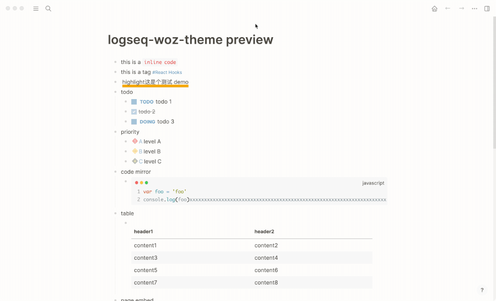

# Logseq Markdown Table Editor Plugin

[English](./README.md) | 简体中文

编辑器参考[https://codesandbox.io/s/yt8jc](https://codesandbox.io/s/yt8jc)

## 使用前请注意
- **多个表格，需要用空行隔开，否则会识别为一个表格。**

## 示例


## 快捷键
- `Tab`: 移动光标到下一个单元格
- `Shift + Tab`: 移动光标到上一个单元格
- `Shift + Enter`: 在当前单元格换行

## 开发
```shell
$ yarn

$ yarn start
```